# Hi-CC魔法球 社区版发布仓库
- Hi-CC魔法球是 海惠艾信息科技有限公司的前端测试覆盖率度量展示工具，通过浏览器插件方式，帮助测试人员/开发人员在测试过程中，能实时获知被测页面的代码覆盖率情况，同时反馈未被测试的代码的行号以便及时补测，是研发测试的**防漏测神器**。
- Hi-CC魔法球提供测试历史覆盖率记录，可累计当天最高覆盖率，累计近期最高覆盖率。
- Hi-CC魔法球 可通过免费浏览器插件部署，也支持混合移动App（企业版），更详细说明参阅[社区版 vs 企业版](#hi-cc魔法球-企业版)

| 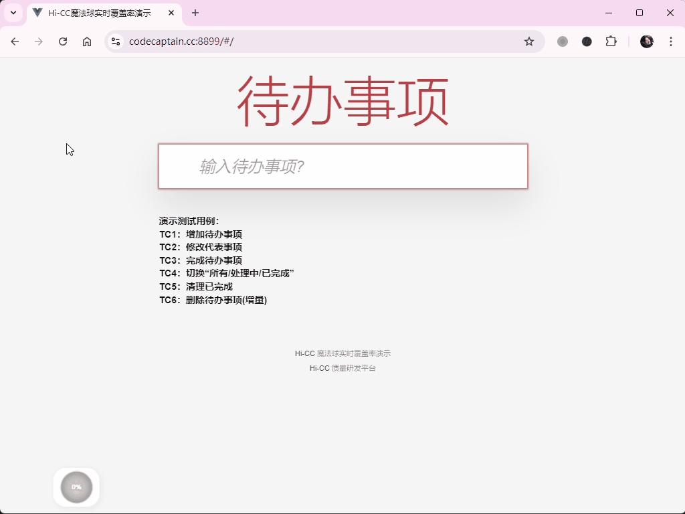 | 
|:--:| 
| *基本功能演示: 点击图片可全屏* |

- Hi-CC魔法球 支持现代前端的三大主流框架 Vue/Anguarl/React
- Hi-CC魔法球 已申请专利
    - 社区版提供企业和个人免费自由使用，具体参见[协议](./LICENSE)

- Hi-CC魔法球入门视频演示（B站） 

<!-- -  -->
<!-- - [/hqdefault.jpg" width="600" height="300"/>](https://www.youtube.com/embed/<VIDEO_ID>) -->

## 官网
- [上海惠艾Hi-CC魔法球专区](https://codecaptain.cc/magic/magic.html)
- [上海惠艾Hi-CC 企业版专区](https://codecaptain.cc/)
- [在线演示地址](https://codecaptain.cc:8899/) 注意先安装Hi-CC魔法球扩展

## 快速入门：功能展示和介绍
- 实时覆盖率度量: 显示一个显示覆盖率比率数值的魔法球，表示当前前端应用的代码覆盖率 。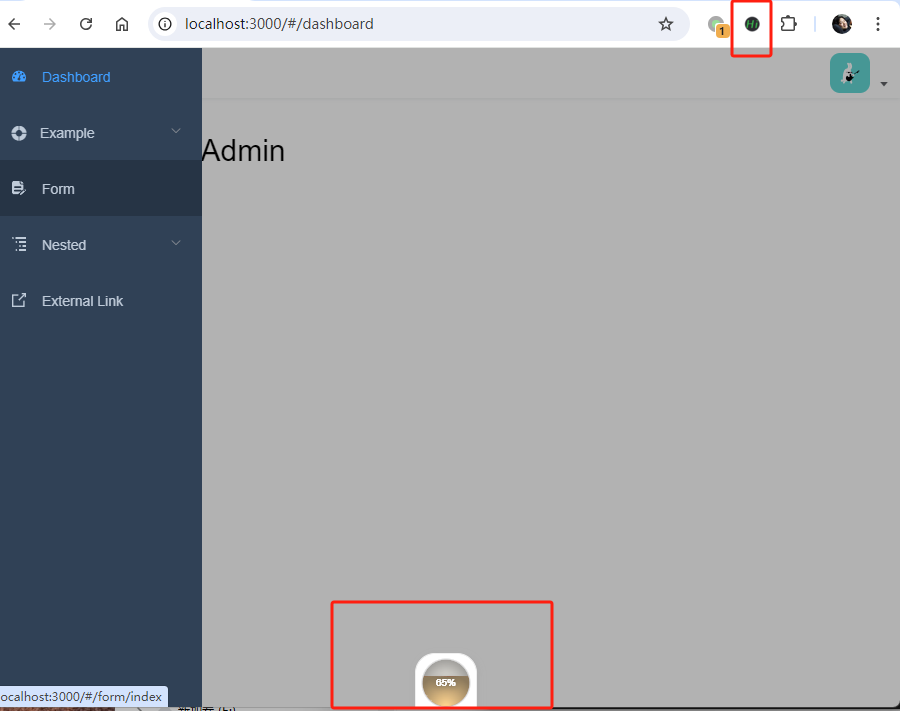
    - 红色水位： 代码覆盖率低于60%
    - 橙色水位： 代码覆盖率高于60%，但低于80%
    - 绿色水位:  代码覆盖率高于80%
- 代码覆盖率列表: 单击魔法球，会显示魔法球面板，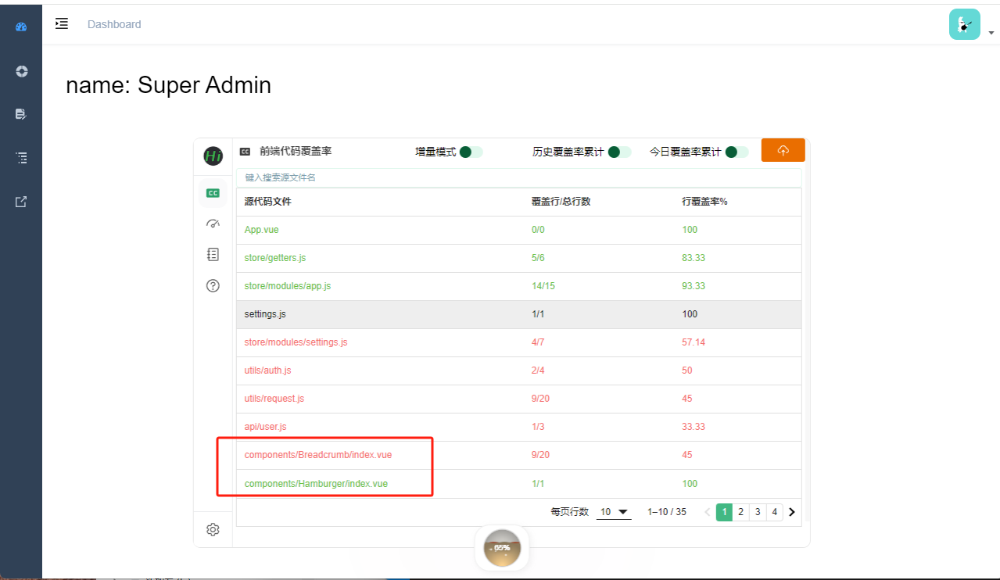
    - 默认显示前端代码文件的覆盖率列表
    - 支持 `.js, .vue, .ts,.jsx`等前端源代码文件的 代码覆盖率，包括已覆盖行，总代码行，以及具体的未覆盖的代码行行号；
    - 今日覆盖率累计 开关： 开启后，会累计当天的代码覆盖率
        - 页面刷新，会重置当前覆盖率数据，开启开关后，会与刷新前的覆盖率数据合并
    - 历史覆盖率累计 开关：开启后，会累计迄今为止的覆盖率
        - 这对于一段测试周期来说，可以累计一周以上的覆盖率数据；
        - 覆盖率数据会每天自动保存一份当天累计数据
        - 保存的历史时间，会受限于浏览器localstorge的存储上限（5兆），当遇到存储上限时，会自动丢弃最旧的数据。
            - 魔法球企业版是通过后台服务保存，不受此限制
    - 增量模式 开关（企业版功能）： 默认是以全量代码覆盖率模式显示，增量表示当前变更代码为基数的代码覆盖率

- 个人覆盖率统计：在魔法球面板左侧点击个人覆盖率统计图标，显示覆盖率一周的趋势图。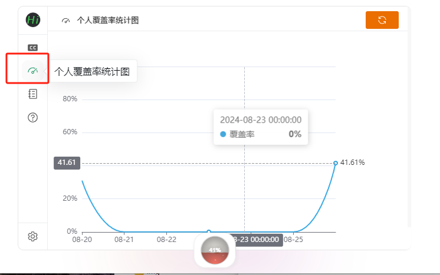
- 每日覆盖率记录: 在魔法球面板左侧点击每日覆盖率图标，显示每天的覆盖率累计数据，可以删除指定日期的覆盖率数据

## 快速入门：如何下载

| 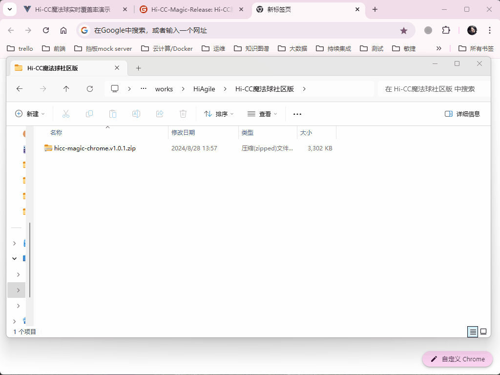 | 
|:--:| 
| *手动安装扩展动图（要开启扩展的开发者模式）: 点击图片可全屏* |

- 预需求：
    - edge/chrome 浏览器： 版本v100+
    - 手动下载安装： 
        - 下载压缩包: [Hi-CC魔法球发布页](https://gitee.com/thm1118/hi-cc-magic/releases)下载最新zip包 [hicc-magic-browse-extension.v1.0.1.zip](https://gitee.com/thm1118/hi-cc-magic/releases/download/v1.0.1/hicc-magic-browse-extension.v1.0.1.zip) .
    - 使用rar/360zip等压缩工具解压缩后的目录 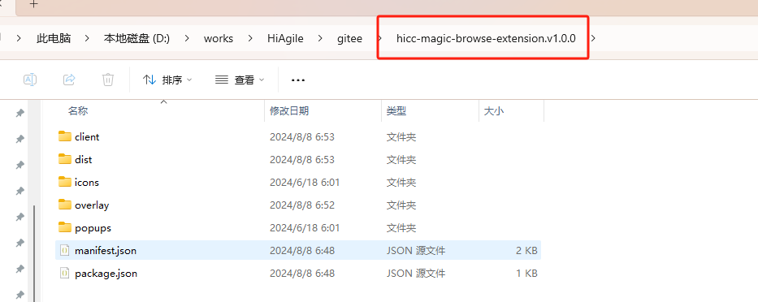
    - 开启浏览器扩展的开发者模式
        - edge浏览器：在扩展管理内的左侧，开启 开发人员模式 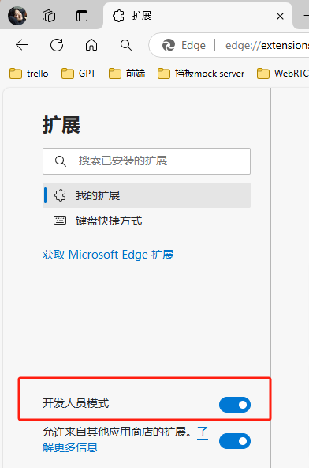
        - chrome浏览器：在扩展管理内的右上方，开启 开发者模式 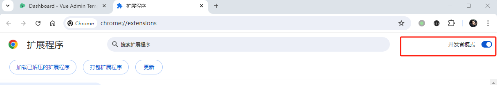
    - 加载已解压的扩展程序
        - edge浏览器：在扩展管理的右上方，点击 加载解压缩的扩展。
        - chrome浏览器：在扩展管理的左上方，点击 加载已解压的扩展程序。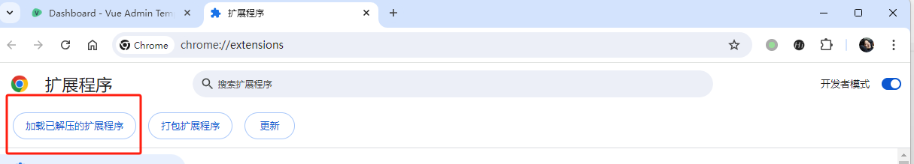
    - 设置hicc魔法球扩展显示
        - edge浏览器：在浏览器地址栏右侧，单击扩展图标，显示 扩展列表，点击 "从工具栏显示"图标。 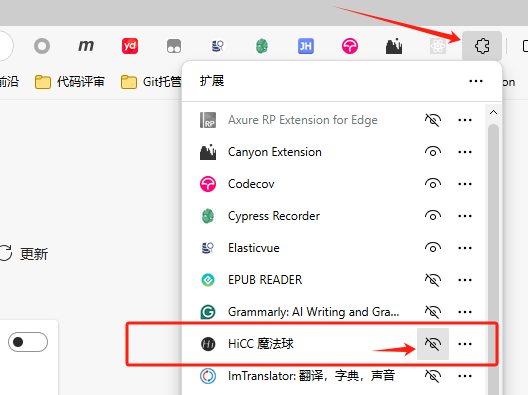
        - chrome浏览器：在浏览器地址栏右侧，单击扩展图标，显示 扩展列表，点击 "固定"图标。 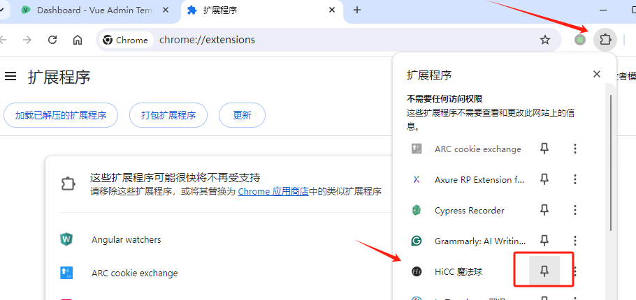
    - 安装成功状态
        - 在浏览器地址栏右侧，显示Hi-CC魔法球扩展图标，
            - 默认是灰色 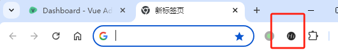
            - 当检测有插桩代码时，是绿色可用状态 ，同时，在浏览器底部显示 魔法球

- 浏览器的扩展商店安装
    - [Edge应用商店，审核中](https://microsoftedge.microsoft.com/addons?hl=zh-CN)
    - 

## 快速入门：如何插桩
- 扩展的正常使用，需要在浏览器中编译后的代码已插桩。本节介绍主流javascript框架是如何插桩的。插桩需要开发人员协助，修改构建配置；插桩过程并不修改源代码；
- 在线演示: 如果手头应用暂时不能插桩 ，可访问[在线演示](https://codecaptain.cc:8899/)，该示例应用与下面的[vue3 示例仓库](https://gitee.com/thm1118/vue3-hicc-magic-demo)是一致的。
- Hi-CC魔法球的帮助页内也有[在线演示](https://codecaptain.cc:8899/)链接
- 本地vue示例项目构建尝试
  - 如需查看vue2.6 的istanbul覆盖率插桩 ，请访问[vue2.6示例](https://gitee.com/thm1118/vue2.6-hicc-magic-demo)
  - 如需查看vue2.5 的istanbul覆盖率插桩 ，请访问[vue2.5示例](https://gitee.com/thm1118/vue2-hicc-magic-demo)
  - 如需查看vue3 的istanbul覆盖率插桩，请访问[vue3 示例](https://gitee.com/thm1118/vue3-hicc-magic-demo)  
  - 如需查看angular6+ 的istanbul覆盖率插桩，请访问[angular6+ 示例](https://gitee.com/thm1118/angular17-hicc-magic-demo)
  - 如需查看react 的istanbul覆盖率插桩，请访问[react17 示例](https://gitee.com/thm1118/react17-hicc-magic-demo)

## 问题建议
- 请在 Issues 里提交

## Hi-CC魔法球 企业版
- Hi-CC魔法球还有企业版本，与社区版的轻量使用不同的是，企业版需要有Hi-CC后端部署支持
- Hi-CC企业版支持更多语言的代码覆盖率的实时展示、智能回归用例推荐等强大功能。
- 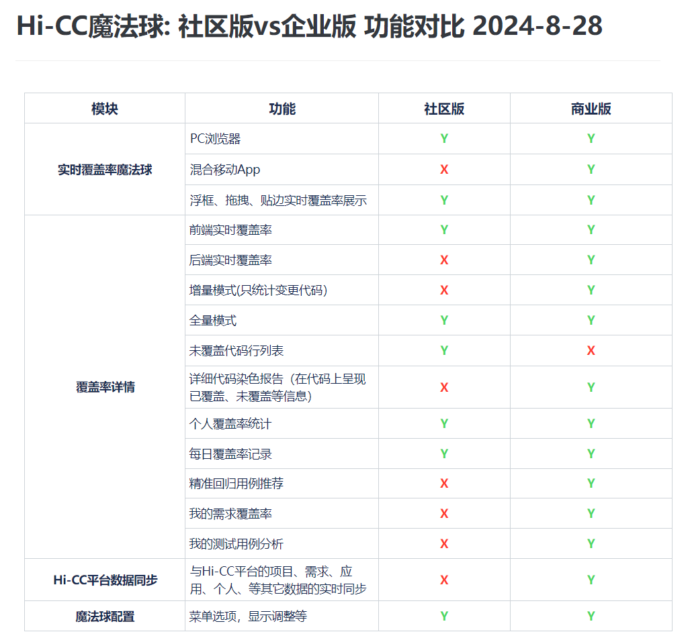

